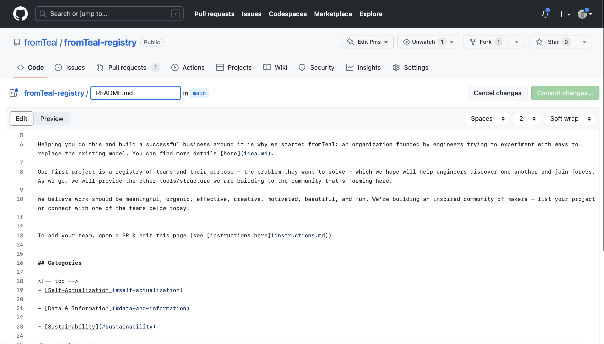
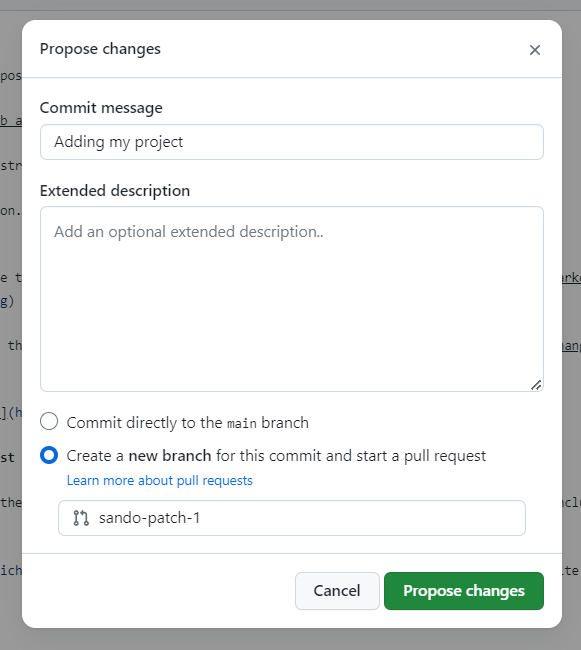

## Adding your project

If you want to add your purpose-driven project, this is how you do it.

First, you'll need a [GitHub account](https://github.com/join)!

1. Access the fromTeal-registry GitHub page: https://github.com/fromTeal/fromTeal-registry

2. Now click on the edit icon.

 

 

3. You can start editing the text of the file in the in-browser editor. You can use [GitHub Flavored Markdown](https://help.github.com/articles/github-flavored-markdown/).
 

 

5. Say why you're proposing the changes, and then click on "Propose file change".

 

6. Submit the [pull request](https://help.github.com/articles/using-pull-requests/)!

 

## Updating your Pull Request

Sometimes, a maintainer of the fromTeal-registry will ask you to edit your Pull Request before it is included. This is normally due to spelling errors or because your PR didn't match the registry guidelines.

[Here](https://github.com/RichardLitt/knowledge/blob/master/github/amending-a-commit-guide.md) is a write up on how to change a Pull Request, and the different ways you can do that.
